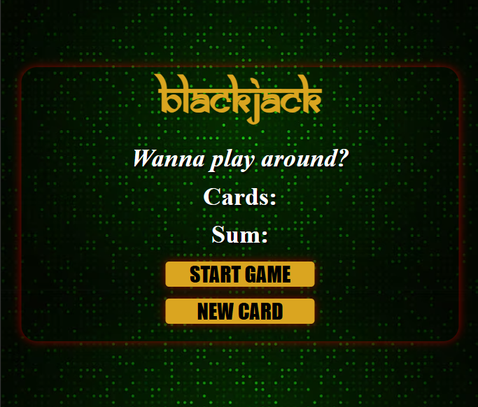

# Simple Blackjack Game

A basic blackjack game created using HTML, CSS, and JavaScript. Players can play against the dealer, with the cards represented by numbers.



## Overview

This is a simple implementation of the blackjack game. The game allows a player to play against the dealer with basic game logic and rules. Players start with an initial amount of $100 and can win or lose money based on their gameplay.

## Features

- User-friendly interface
- Display of cards as numbers
- Start Game and New Card buttons
- Initial player money: $100

## How to Play

1. **Start the Game:** Click the `Start Game` button to begin. You will receive two cards as numbers.
   - If you get a blackjack (sum of 21), you win $50.
   - If the sum is less than 21, you can click the `New Card` button to draw another card.
2. **Game Rules:**
   - If your sum exceeds 21, you lose $20.
   - The dealer will play after you stand.
   - The objective is to get as close to 21 as possible without exceeding it.

## Installation

To get a local copy up and running, follow these simple steps:

1. **Clone the repository:**

   ```sh
   git clone https://github.com/your-username/simple-blackjack-game.git
